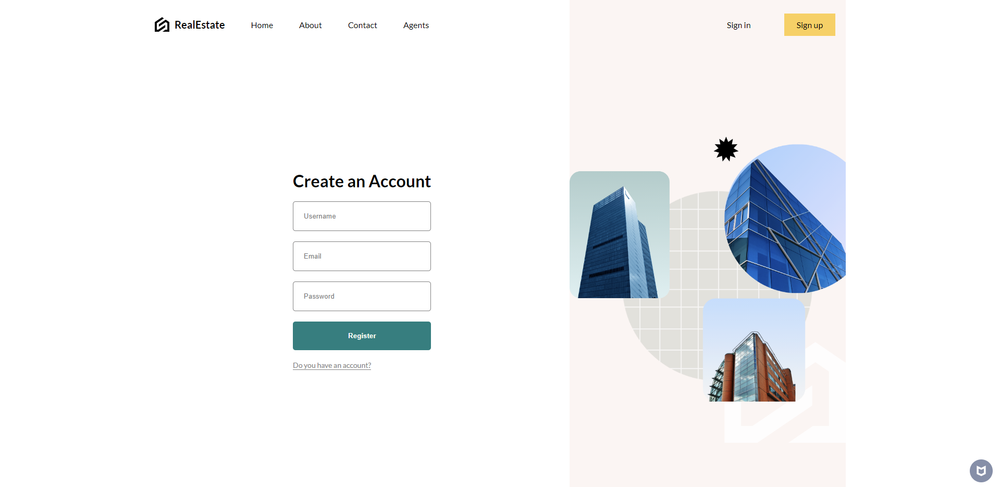

# Real Estate App

---
Here's a comprehensive `README.md` for your project based on the provided information:

---

# Real Estate Application

## Overview
This project introduces a full-stack real estate application built using the MERN stack (MongoDB, Express.js, React.js, Node.js). The platform is designed to offer an efficient and scalable solution for property management. It allows users to browse, search, and interact with real estate listings, providing features like secure authentication, real-time chat, and advanced property filtering.

## Table of Contents
1. [Description](#description)
2. [Problem Statement](#problem-statement)
3. [Proposed Solution](#proposed-solution)
4. [Objectives](#objectives)
5. [Software Requirements](#software-requirements)
   - [Functional Requirements](#functional-requirements)
   - [Non-Functional Requirements](#non-functional-requirements)
6. [Code](#code)
7. [Output Screenshots](#output-screenshots)
8. [Database, Tables, and ER Diagram](#database-tables-and-er-diagram)

---

## Description
The Real Estate Application is a full-stack project leveraging the MERN stack to streamline property management. The platform offers users the ability to:
- Search for properties based on various criteria such as location, price range, and property type.
- Visualize property locations through an interactive map.
- Securely register, log in, and save favorite properties using JWT-based authentication.
- Communicate in real-time using integrated chat functionality powered by Socket.io.
- Upload and preview property images to enhance listings.

The application provides an efficient, secure, and user-friendly interface for exploring and managing real estate listings.

## Problem Statement
The traditional real estate industry faces challenges such as fragmented information, inadequate communication, security concerns, and a lack of interactive visualization tools. Users often find it difficult to discover comprehensive listings, leading to time-consuming processes and misunderstandings in transactions.

## Proposed Solution
The proposed solution is a full-stack real estate application built with the MERN stack. This application addresses industry challenges through the following key features:
- **Advanced Search and Filtering:** Users can search for properties based on location, price, and other criteria to streamline property discovery.
- **Interactive Map Integration:** A visual representation of property locations helps users make informed decisions.
- **Real-Time Chat:** Facilitates instant communication between property seekers and owners.
- **Secure User Authentication:** Ensures protected registration, login, and user information management.
- **Image Uploading and Preview:** Allows owners to upload and preview images, enhancing property presentations.

### Benefits
The platform empowers users by simplifying property transactions and offering a centralized solution for efficient property management, real-time communication, and secure interactions.

## Objectives
- **Streamline Real Estate Transactions:** Develop an intuitive platform to facilitate smooth transactions between buyers, renters, and sellers.
- **Enhance Property Discovery:** Implement comprehensive filtering and sorting functionalities for property search.
- **Facilitate Direct Communication:** Provide a secure messaging system to allow direct inquiries and negotiations.
- **Personalized User Experience:** Allow users to manage saved listings and receive tailored notifications.
- **Secure and Scalable Platform:** Ensure reliable performance, data security, and scalable infrastructure.

## Software Requirements

### Functional Requirements
1. **User Interaction**
   - Engaging user interface for browsing and searching properties using React.
   - Intuitive search bar for inputting criteria like location and price range using Node.js.
2. **Property Management**
   - Property owners can create, edit, and delete property listings.
   - Users can filter property listings based on criteria like location, price range, and property type.
3. **Real-Time Chat**
   - Real-time chat conversations through an integrated interface using Socket.io.
   - Notifications for new messages.
4. **Image Handling**
   - Upload multiple images with a preview option before submission.
5. **User Authentication**
   - Secure user registration, login, and session maintenance using JWT.
6. **User Profile Management**
   - View and edit profile information.
   - Save favorite properties for easy access.
7. **Notification System**
   - Alerts for new messages and updates on property listings.
   - Customizable notification preferences.

### Non-Functional Requirements
1. **Performance**
   - Property listings should load within 3 seconds.
   - Support at least 100 simultaneous users without performance degradation.
2. **Security**
   - Secure user authentication with JWT.
   - Encrypt sensitive user information before storing it in the database.
3. **Usability**
   - Provide a responsive design accessible on both desktop and mobile devices.
   - Include help and support documentation.
4. **Reliability**
   - Maintain 99.9% uptime to ensure availability.
   - Implement automated daily backups of user data and property listings.
5. **Scalability**
   - Handle an increasing number of users and properties as the platform grows.
   - Support the addition of new features without significant changes to the existing codebase.

## Output Screenshots
### 1. HomePage

### 2. Sign Up Page

### 3. User Search

## Database, Tables, and ER Diagram

---

This `README.md` outlines the project's scope, goals, and detailed requirements to guide users and contributors. Let me know if you want to add more details or specific instructions for running the project!
